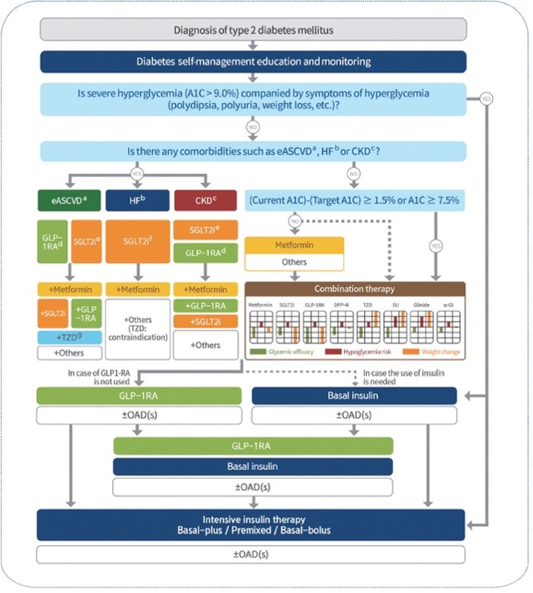

## Diabetes Personalized Treatment Trial (DPTT):A Superiority Trial of Risk-Stratified treatment on diverse outcomes in Type 2 Diabetes Mellitus

### Writer : [Sang Ho Park](https://www.linkedin.com/in/shstat1729/)

### Administrative information
#### Title : 
Diabetes Personalized Treatment Trial (DPTT): A Superiority Trial of Risk-Stratified treatment on diverse outcomes in Type 2 Diabetes Mellitus

#### Trial registration :
NCT00000001 (clinicaltrials.gov)

#### Protocol version :
Ver 1.0

#### Funding :
American Diabetes Association, Korean Diabetes Association, and pharmaceutical companies

#### Roles and responsibilities :
Sang Ho Park : all of things related to the clinical trial.

### Introduction
#### Background and rationale :
The era of precision medicine presents an opportunity to develop personalized treatment approaches for patients with type 2 diabetes mellitus (T2DM) based on their individual characteristics and risk profiles. This personalized approach aims to optimize treatment by considering each patient's specific risk factors for diabetic complications and mortality.

Current clinical guidelines recommend targeted therapeutic strategies based on patient-specific risk factors. For T2DM patients at high cardiovascular risk, SGLT2 inhibitors are recommended as a preventive measure against cardiovascular disease (Diabetes Care 2025;48(Suppl. 1):S207–S238). Similarly, SGLT2 inhibitors are indicated for patients at high risk of chronic kidney disease progression (Diabetes Care 2025;48(Supplement_1):S239–S251).

The therapeutic landscape for T2DM management includes several key medication classes. GLP-1 receptor agonists (GLP-1RAs) play a crucial role in weight management and addressing obesity-related comorbidities, including metabolic dysfunction-associated steatotic liver disease (MASLD) (Clinical Practice Guidelines, Volume 81, Issue 3, p492-542, September 2024). Additional therapeutic options include metformin, thiazolidinediones (TZD), and basal insulin, each offering distinct benefits based on patient characteristics (Diabetes & Metabolism Journal 2023;47(5):575-594.).

Our proposed treatment strategy aims to align medication selection with individual patient risk profiles, particularly focusing on mortality risk stratification. This approach will enable more precise and personalized therapeutic decisions for T2DM patients.
 

Reference of figure : Diabetes & Metabolism Journal 2023;47(5):575-594. 

#### Objectives : 
To propose personalized treatment with type 2 diabetes mellitus patients based on their risks for diverse outcomes for the prevention of complication and mortality.

#### Trial design :
- Umbrella trial based on their risk values for diverse outcomes.
- Superiority trial for new treatment over treatment as usual.
- Methods: Participants, interventions, and outcomes

#### Study setting :
- Multi-institutional hospitals.

#### Eligibility criteria :
Inclusion criteria : 
-	Type 2 diabetes mellitus patients 
-	Equal to or more than HbA1c 6.5% level.
Exclusion criteria :
-	Insulin user
-	History with cardiovascular disease (CVD), chronic kidney disease (CKD), or metabolic dysfunction-associated steatotic liver disease (MASLD)

#### Interventions :
We calculated risk scores based on diverse outcomes such as CVD, CKD, MASLD, and mortality using Korean National Health Insurance System. If subject’s risk of CVD is in highest quartile group, then subject would be allocated CVD risk Q4 group. If subject’s risk of CKD is in highest quartile group, then subject would be allocated CKD risk Q4 group. If subject’s risk of MASLD is in highest quartile group, then subject would be allocated MASLD risk Q4 group. If subject’s risk of CVD, CKD, or MASLD is not in highest quartile groups, then subject would be allocated mortality risk group. If subject has more than one highest risk quartile group for CVD, CKD, or MASLD, assign them to the multiple risks group. However, if needed, Diabetes Personalized Treatment Committee (DPTC) could allocate subject to other groups or exclude subject in the trial. DPTC consists of endocrinologists, cardiologists, nephrologists.

After allocation, we randomized subjects in each group to allocate whether new treatment group or control group (treatment as usual). For CVD group, new treatments are metformin, SGLT2 inhibitor, and statin. For CKD group, new treatments are metformin and SGLT2 inhibitor. For MASLD group, new treatments are metformin and GLP1-RA. For mortality group, new treatments for lowest quartile group are lifestyle modification and metformin. New treatments for 2nd quartile group are metformin and TZD. New treatments for 3rd quartile group are metformin and SGLT2 inhibitor. New treatments for highest quartile group are metformin, GLP1-RA, and basal insulin. For multiple risks group, new treatments are metformin, SGLT2 inhibitor, and GLP1-RA. Every 6 months during follow-up, if secondary endpoint is not met, drug will be added or deleted based on DPTC’s opinion.
 

#### Outcomes : 
Primary endpoint : 

For CVD group : CVD incidence

For CKD group : CKD incidence

For MASLD group : MASLD incidence

For multiple risks group : All-cause mortality

For mortality group : All-cause mortality

Secondary endpoint : 

For CVD group : 0.5% reduction of HbA1c level

For CKD group : 0.5% reduction of HbA1c level

For MASLD group : 0.5% reduction of HbA1c level

For multiple risks group: 0.5% reduction of HbA1c level

For mortality group in lowest quartile group: 0.3% reduction of HbA1c level

For mortality group in 2nd quartile group: 0.5% reduction of HbA1c level

For mortality group in 3rd quartile group: 0.7% reduction of HbA1c level

For mortality group in highest quartile group: 1% reduction of HbA1c level

#### Participant timeline :
Time schedule of enrolment : 2024.12.31

Interventions : After enrolment, as soon as possible

Assessments : outcome or intercurrent event occurs or follow-up ends

Visits : Every six months for measurement of outcome

#### Sample size : 
By sample size calculation for eight trials using superiority trial, each trial would need 10,000 samples each. Therefore, total number of samples is 80,000

#### Recruitment : 
Advertisement in each hospital.

#### Methods: Assignment of interventions (for controlled trials)
#### Allocation : Sequence generation : Using R program, random sequence would be generated for each group.

#### Allocation concealment mechanism : Using sealed envelopes.

Implementation : By biostatisticians.

#### Blinding : Outcome assessors, data analysis

#### Methods: Data collection, management, and analysis
#### Data collection methods :
In first visit, caregiver measures baseline covariates. Every six months visit, caregiver measures participants’ outcome.

#### Data management :
Data would be collected and shared in private cloud platform system. Also, the cloud platform system would record any change log.

#### Statistical methods : Cox regression for primary outcome. Also, we use t-test for secondary outcome.

#### Methods: Monitoring

#### Data monitoring :
Every 6 months visit, secondary outcome would be analyzed by data monitoring committee. If secondary outcome will not be met, data monitoring committee notifies the failure of treatment to DPTC for each participant. 

#### Harms :
Clinical research coordinator would collect safety data by periodic call every month.

#### Auditing : NA

Ethics and dissemination

#### Research ethics approval :
IRB was approved by Samsung Medical Center.

#### Protocol amendments :
Every six months, we would modify protocol based on DPTC’s opinion.

#### Consent or assent :
By clinical research coordinator

#### Confidentiality :
By clinical research coordinator, data would be collected and shared in private cloud platform system. Also, the cloud platform system would record any change log.

#### Declaration of interests : 
NA

#### Access to data :
Biostatisticians and Data management team only

#### Ancillary and post-trial care :
NA

#### Dissemination policy :
For participants, we will send the result of trial.

For healthcare professionals and the public, we will publish the result of trial in prestigious journal.

#### Appendices
Informed consent materials : in the appendix, we attach informed consent form.
Biological specimens : For each trial site, caregivers in each institution collect, measure, and store biological specimens.

